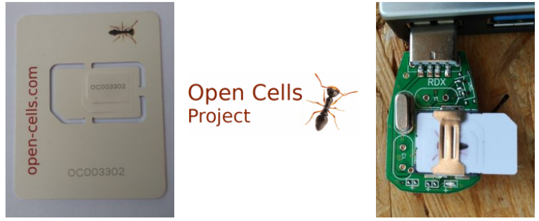

<p align="center">
  
</p>

Visitamos la web con el siguiente enlace:

+ <https://open-cells.com/>

+ <https://open-cells.com/index.php/sim-cards/>

Con el desarrollo de la siguiente aplicación se puede leer/escribir en la SIM:

Accedemos a la siguiente página web para buscar al final de ella el enlace para la descarga del programa (source code):

+ <https://open-cells.com/index.php/uiccsim-programing/>

A continuación vamos a la carpeta de "descargas" y descomprimimos el fichero para tener el ejecutable.

<p align="center">
  
</p>

A continuación abrimos un "terminal", nos movemos hasta la carpeta que contiene el fichero ejecutable y ponemos:

```**#sudo ./program_uicc**```

Se produce un error con la última versión de la aplicación (si instalamos la versión 2.5 no ocurre).

Seguimos con el tutorial. Insertamos el lector/grabador con una SIM y procedemos a leerla:

`**#sudo DEBUG=y ./program_uicc**`

Se puede consultar la ayuda en línea mediante el comando:

```
**#sudo ./program_uicc --help**
```

Una configuración típica sería:

#sudo ./program_uicc --adm 12345678 --imsi 208920100001101 --isdn 00000001 --acc 0001 --key 6874736969202073796d4b2079650a73 --opc 504f20634f6320504f50206363500a4f --spn "OpenCells01" --authenticate --noreadafter

Es importante el parámetro "adm" que es el valor de 8 dígitos que viene grabada en la propia SIM de forma visual:

**Para corregir el error**: ./program_uicc: /lib/x86_64-linux-gnu/libstdc++.so.6: version \`GLIBCXX_3.4.29' not found (required by ./program_uicc)

sudo add-apt-repository ppa:ubuntu-toolchain-r/test

sudo apt-get update

sudo apt-get install gcc-4.9

sudo apt-get upgrade libstdc++6

After this is complete, make sure to run the following:

sudo apt-get dist-upgrade

Also, make sure to confirm the necessary dependencies are installed for the right GLIBCXX version.

strings /usr/lib/x86_64-linux-gnu/libstdc++.so.6 | grep GLIBCXX