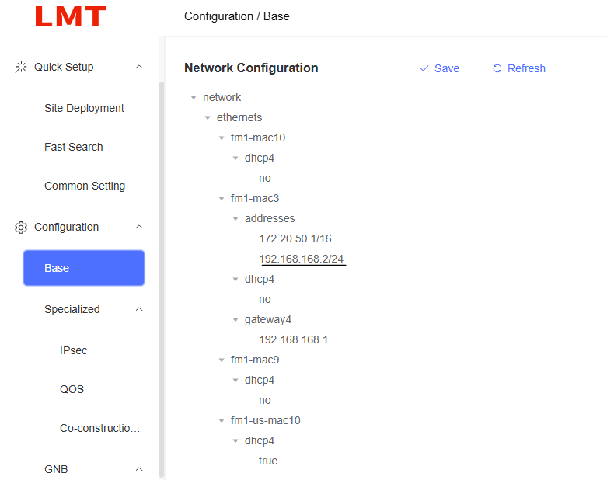
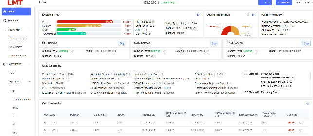
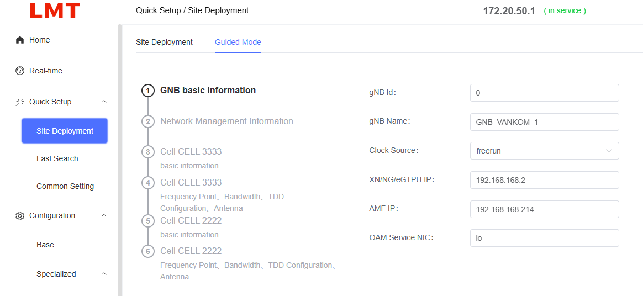
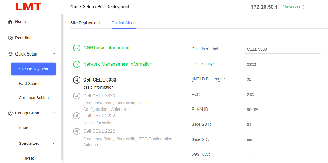
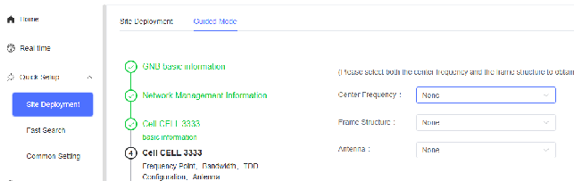

# MANUAL VANKOM 5G

## Índice

- [MANUAL VANKOM 5G](#manual-vankom-5g)
  - [Índice](#índice)
  - [1. Configuración inicial](#1-configuración-inicial)
  - [2. Información básica](#2-información-básica)
  - [3. Configuración](#3-configuración)
    - [3.1 Configuración conexión a core](#31-configuración-conexión-a-core)
    - [3.2 Configuración celda](#32-configuración-celda)

---

## 1. Configuración inicial

Para acceder a la radio desde la LAN: accedemos desde `172.20.50.1`

*Connect the computer to the GE interface of the base station, enter
the 172.20.50.1 (default) address in the browser to enter the LMT login
page; You can also log in by connecting the computer to the optical port
and entering the optical port address.
On the login page, you can click [Verification Code] to switch, fill
in the correct user name, password, and verification code, and click [Login]
to enter the LMT system, as shown in the figure.*

- **Account:** admin
- **Password:** lmt_2023

Configuramos la WAN:

---

## 2. Información básica

En "Home" tenemos el estado del gNB y los datos de la celda.

---

## 3. Configuración

### 3.1 Configuración conexión a core

Para configurar la radio accedemos a "Quick Setup" y "Guided Mode"

- **eGTPU:** Ponemos la IP de la radio
- **AMF IP:** Ponemos la IP del core

### 3.2 Configuración celda

**Paso 3:**

Podemos modificar: PCI, PLMN, SST y SD, TAC…

> ⚠️ **Importante:** PLMN y TAC deben coincidir con los del Core  
> ⚠️ `SD ffffff` es el slice que lleva por defecto

**Paso 4:**

Configurar parámetros radio y del gNB:

- Ancho de banda
- Frecuencia

